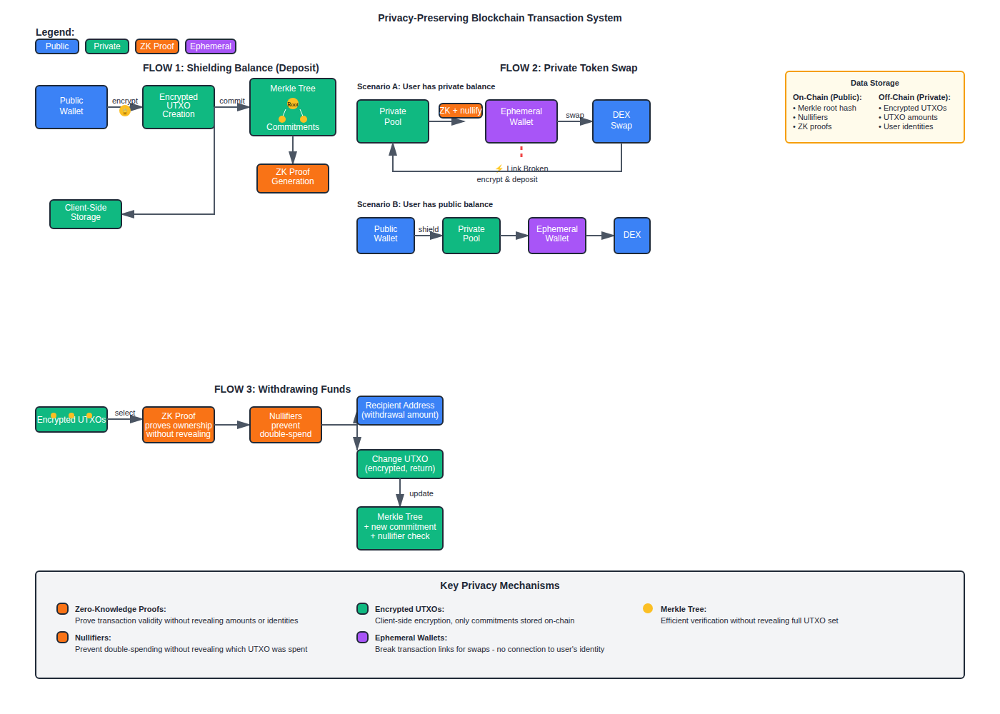

  
  
  # CircuitX Swap
  
  **Swap without the spotlight.**
  
  Swap and transfer privately on Solana
  
  [Launch App](https://swap.circuitx.live) | [Twitter](https://x.com/circuitx_app)

`private-swap` `shield-assets`

---

## Overview

CircuitX Swap is a privacy-focused DEX on Solana that enables confidential swaps, transfers, assets shielding using zero-knowledge proofs. Shield your assets, swap privately, and transfer/withdraw tokens without exposing amounts or addresses on-chain.

## Features

**Private Swaps on Solana Mainnet**  
Execute swaps on mainnet with full privacy protection.

**Shield**  
Shield assets into a private state before swapping or transferring.

**Transfer Privately**  
Send tokens privately so amounts and addresses stay off public view.

**ZK-Based Privacy**  
Zero-knowledge proofs ensure amounts and addresses aren't exposed on-chain.

**Multi-Token Support**  
Trade SOL, USDC, and other supported tokens.

---

## How It Works

### Privacy Flow

CircuitX uses ephemeral wallets and zero-knowledge proofs to keep your transactions private:

1. **Shield (Deposit)** - Lock your tokens into a private pool using a commitment hash
2. **Private Action** - Swap or transfer within the shielded pool
3. **Unshield (Withdraw)** - Withdraw to any address with full privacy

  

---

## User Guide

### Send Private Transactions

**Step 1:** Go to [swap.circuitx.live](https://swap.circuitx.live)

**Step 2:** Navigate to the **Send** tab

**Step 3:** Shield some amount of SOL you want to privately send
- Enter the amount to shield
- Sign the transaction and confirm deposit

**Step 4:** Navigate to **Withdraw/Unshield**
- Input the recipient address
- Enter the amount to withdraw
- Confirm the withdrawal transaction

Private transaction completed.

---

### Swap Privately

**Step 1:** Go to [swap.circuitx.live](https://swap.circuitx.live)

**Step 2:** Navigate to the **Swap** tab

**Step 3:** Shield your input token
- Select the token you want to swap from (e.g., SOL)
- Enter the amount to shield
- Sign and confirm the deposit transaction

**Step 4:** Execute the private swap
- Select the token you want to swap to (e.g., USDC)
- Enter the swap amount
- Review the swap details
- Confirm the swap transaction

**Step 5:** Unshield your output tokens (optional)
- Navigate to **Withdraw/Unshield**
- Select the output token
- Enter the withdrawal address and amount
- Confirm the withdrawal

Your swap remains private throughout the entire process.

---

## Technical Architecture

CircuitX leverages:
- **Privacy Cash Protocol** - ZK-based privacy layer for Solana
- **Jupiter Aggregator** - Best swap execution and liquidity routing
- **Circom ZK Circuits** - Zero-knowledge proof generation
- **Ephemeral Wallets** - Temporary wallets for anonymous transactions

---

## Security

All circuits have been audited by Zigtur Security:
- [SOL Circuit Audit](sdk-code/audits/Zigtur%20SOL%20Audit.pdf)
- [USDC Circuit Audit](sdk-code/audits/Zigtur%20USDC%20Audit.pdf)
- [USDT Circuit Audit](sdk-code/audits/Zigtur%20USDT%20Audit.pdf)

---

## Links

- **App**: [swap.circuitx.live](https://swap.circuitx.live)
- **Twitter**: [@circuitx_app](https://x.com/circuitx_app)
- **Documentation**: [Docs](https://swap.circuitx.live/docs)

---

## License

MIT
